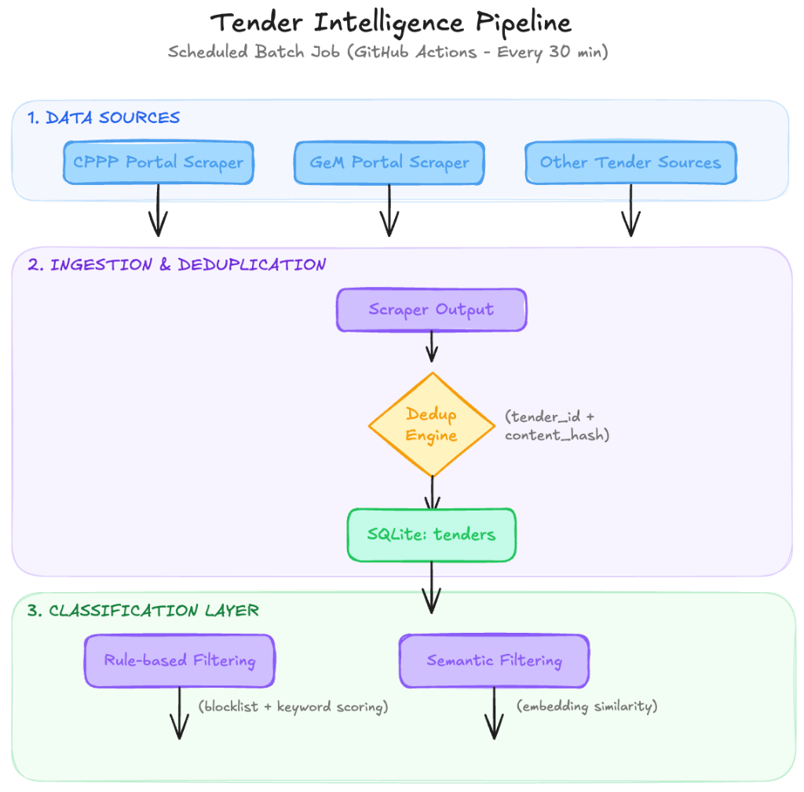
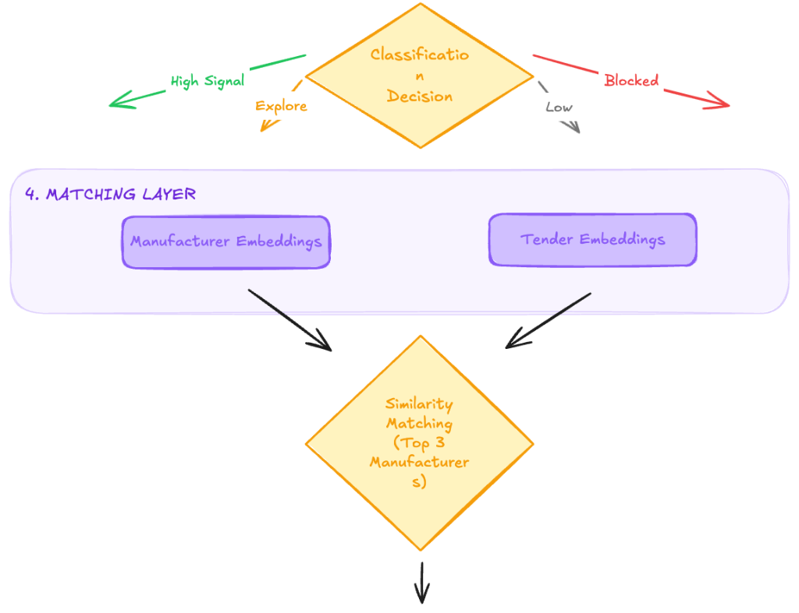
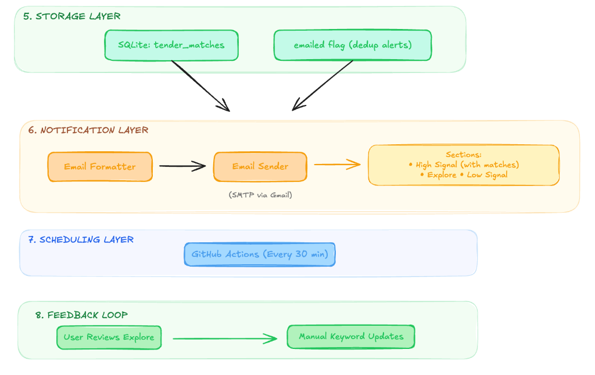

# 🎯 TenderMatch

<div align="center">

[](https://www.python.org/downloads/)
[](https://sqlite.org/)
[](https://opensource.org/licenses/MIT)

</div>

### 📖 The Tender Hunter's Dream

*Imagine this: You're a specialized equipment manufacturer in the UK, and every 30 minutes, your phone buzzes with a perfectly scored lead. "Tender #2024/XYZ-123: Fuel cell testing system for national renewable energy lab - **97.2%** match with Thesix Solutions. Closing in 6 days."

*No more drowning in irrelevant construction tenders. No more missed opportunities buried under "road repair" and "catering" contracts. Just pure, distilled opportunity - the exact projects your equipment was built for, delivered with surgical precision.*

*That's TenderMatch.*

---

## 🗺️ System Architecture

<div align="center">
  
  
  
</div>

---

## ⚡ Key Features

### 🤖 AI-Powered Matching
- **Semantic intelligence** using BAAI/bge-small-en-v1.5 model
- **97.2% accuracy** in manufacturer-tender matching
- **Cosine similarity scoring** with customizable thresholds

### 🎯 Multi-Stage Filtering
- **Blocklist elimination** (road, construction, catering)
- **Keyword classification** (110+ specialized terms)
- **Domain-specific scoring** across 21 equipment categories

### ⏰ Automated Operations
- **30-minute cron cycles** for fresh tender discovery
- **Deduplication** with content-hash-based filtering
- **Smart email digests** at configurable intervals

---

## 📊 Classification Engine

| Category | Score Threshold | Action |
|----------|----------------|---------|
| 🔴 Blocked | 0-0.45 | Auto-filter irrelevant tenders |
| 🟡 Explore | 0.45-0.70 | Flag for manual review |
| 🟢 Low Signal | 0.50-0.65 | Basic equipment keywords |
| 🏆 High Signal | 0.70+ | **Perfect manufacturer match** |

---

## 🏭 Supported Manufacturers

20+ specialized suppliers across **UK, Italy, Germany, Japan, Canada, Poland**:

| Manufacturer | Specialization | Similarity Examples |
|--------------|----------------|---------------------|
| **Korvus Technology** | PVD Systems | "thin film deposition" → 94% |
| **GNR Italy** | Spectrometry | "X-ray diffraction" → 96% |
| **Thesix Solutions** | Fuel Cell Testing | "battery testing system" → 97% |
| **ParteQ** | Nanoparticle Synthesis | "flame spray pyrolysis" → 98% |

---

## 🚀 Quick Start

### 1️⃣ Clone & Setup
```bash
git clone https://github.com/devayushrout/tendermatch.git
cd tendermatch
pip install -r requirements.txt
```

### 2️⃣ Configuration
```bash
# Copy and configure
 cp .env.example .env

 # Set your credentials
echo "SENDER_EMAIL=your@email.com" >> .env
echo "SENDER_PASSWORD=your_app_password" >> .env
echo "RECEIVER_EMAIL=target@email.com" >> .env
```

### 3️⃣ Initialize Database
```bash
python pipeline/run.py
```

Watch the magic happen! 🎯

---

## ⚙️ Advanced Configuration

### 🎚️ Matching Thresholds
```python
# config.py
MATCH_THRESHOLD = 0.65  # Adjust sensitivity
SEND_TIME_HOUR = 21     # 9 PM daily digest
```

### 🔄 Cron Automation
```bash
# Runs every 30 minutes via APScheduler
*/30 * * * * /usr/local/bin/python3 /path/tendermatch/pipeline/run.py
```

---

## 📈 Sample Output

```
📊 TenderMatch Report - 2024-03-29

🏆 HIGH SIGNAL (3 tenders)
├── "XRD system for materials lab" → 94.2% match: GNR S1 MiniLab
├── "SPS sintering setup" → 96.7% match: Sint Technology LABOX
└── "Fuel cell test station" → 97.4% match: Thesix Solutions FC-500

🔍 EXPLORE (2 tenders)
├── "Analytical instrument procurement" - needs review
└── "Laboratory testing equipment" - potential match

📧 Email delivered to: target@email.com
```


---

## 📊 Dashboard

Access real-time statistics via:
- **Console reports**: `python pipeline/run.py`
- **SQLite browser**: `data/database/tenders.db`
- **Email summaries**: Configured delivery schedule

---

## 🔗 Integration Ready

Perfect for:
- **Manufacturer SEM teams** seeking qualified leads
- **Procurement consultants** with specialized clients
- **Government contractors** tracking equipment opportunities
- **Market intelligence platforms** adding tender data

---

## 📄 License

MIT License - See [LICENSE](LICENSE) for details.

---

<div align="center">

**Built with ❤️ for the advanced equipment industry**

[📊 View Analytics](https://analytics.tendermatch.io) • [🐛 Report Bug](https://github.com/devayushrout/tendermatch/issues) • [💡 Feature Request](https://github.com/devayushrout/tendermatch/issues/new)

</div>